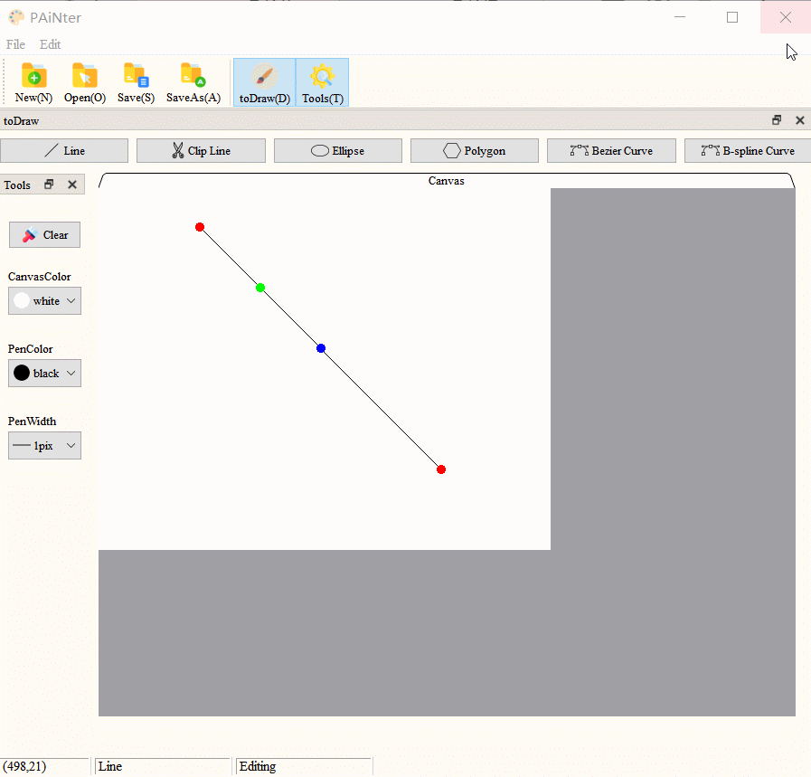

# **MyPainter系统使用说明书**
### 作者：陈攀岭  学号：171860516
（南京大学 计算机科学与技术系，南京 210093）
***
**摘要**：经过一个学期的学习，终于完成了图形学的大作业，实现了实验的系统功能基本要求，也完成了用户交互的实现。其中命令行基本功能，有线段、椭圆、多边形、曲线（Bezier曲线和三次B样条曲线）的绘制生成、平移以及缩放功能，线段、多边形和曲线的旋转功能，线段的裁剪功能，以及画布的重置，画笔颜色设置，位图的保存功能。交互式的图形界面在此基础上有一定的拓展增加，更加用户友好并且完善。

**关键词**：图形学，算法
***
## **一、开发环境说明**
|编程语言|开发平台|GUI开发框架|
|:-:|:-:|:-:|
|C++|Windows 10|Qt 5.13.1|
***
## **二、代码编译说明**

1. 安装Qt 5.13.1版本，安装构建套件Desktop Qt MSVC 2017 32bit
2. 打开[source](./source)文件夹，打开[MyPainter.pro](./source/MyPainter.pro)文件，打开项目
3. 选择构建套件Desktop Qt MSVC 2017 32bit
4. 点击运行按钮（ctrl+R），项目编译运行，应用程序输出
5. 运行成功
***
## **三、程序运行说明**
可从以下两种方式中任选一种运行；
1. 按照**二、代码编译说明**中进行编译运行
2. 应用程序已经打包成为[MyPainter.exe](./binary/MyPainter.exe)，直接打开该程序就可直接运行
***
## **四、系统功能说明**
### **1.系统整体窗口说明**
系统主窗口界面：

主界面总体来说可以分作五个部分：
1. **菜单栏**：分为两个子菜单栏 ***File*** 和 ***Edit***
    * ***File*** 栏下有四个跟文件有关的菜单项，分别为：
        * ***New***（快捷方式Ctrl+N）：新建画布
        * ***Open***（快捷方式Ctrl+O）：打开图片文件，支持的图片格式为 *.bmp* *.png* *.jpg* *.jpeg*
        * ***Save***（快捷方式Ctrl+S）：保存图片文件，支持的图片格式为 *.bmp* *.png* *.jpg* *.jpeg*
        * ***SaveAs***（快捷方式Ctrl+A）：图片另存为，可将图片选择保存在另外的路径，支持的图片格式为 *.bmp* *.png* *.jpg* *.jpeg*
    * ***Edit*** 栏下有两个跟图像绘制有关的菜单项，分别为：
        * ***toDraw***（快捷方式Ctrl+D）：显示工具栏 ***toDraw*** ，菜单项显示已选则该工具栏已显示，若菜单栏未选则工具栏隐藏
        * ***Tools***（快捷方式Ctrl+T）：显示工具栏 ***Tools*** ，菜单项显示已选则该工具栏已显示，若菜单栏未选则工具栏隐藏
    * 菜单栏下方可移动主界面工具栏中的6个图标分别表示 ***File*** 的4个菜单项和 ***Edit*** 的2个菜单项共6个菜单项
2. ***toDraw*** 工具栏：包含6个图元绘制按钮。可通过**菜单栏**或**关闭按钮**进行隐藏和显示；可通过**鼠标拖动窗口**或**还原按钮**设置窗口为浮动状态；可通过**鼠标拖动窗口**将工具栏置于主界面上方或下方
    * ***Line***：绘制线段
    * ***Clip Line***：裁剪线段
    * ***Ellipse***：绘制椭圆
    * ***Polygon***：绘制多边形
    * ***Bezier Curve***：绘制Bezier曲线
    * ***B-spline Curve***：绘制三次B样条曲线
3. ***Tools*** 工具栏：包含4个绘画工具。可通过**菜单栏**或**关闭按钮**进行隐藏和显示；可通过**鼠标拖动窗口**或**还原按钮**设置窗口为浮动状态；可通过**鼠标拖动窗口**将工具栏置于主界面左侧或右侧
    * ***Clear***：清楚画布上所有像素点，仅保留画布
    * ***CanvasColor***：选择设置画布颜色
    * ***PenColor***：选择设置画笔颜色
    * ***PenWidth***：选择设置画笔粗细尺寸
4. ***Canvas*** 画布窗口
    * 灰色背景为画布窗口，画布展示在该窗口中
    * 画布位于窗口左上位置，可通过鼠标拖动右下角设置画布的尺寸
5. **状态栏**：从左至右分为三个部分显示信息
    * **鼠标位置**：以坐标形式显示鼠标位于当前画布的位置
    * **绘制类型**：显示当前绘制的图元类型， *"None"* *"Line"* *"Ellipse"* *"Polygon"* *"Bezier Curve"* *"B-spline Curve"* 分别表示 *“未选择图元”* *“线段”* *“椭圆”* *“多边形”* *“Bezier曲线”* *“三次B样条曲线”*
    * **当前绘制状态**：显示当前图像绘制状态，*"Waiting"* *"Drawing"* *"Editing"* *Reseting Canvas"* 分别表示 *“等待绘制状态”* *“绘制图像状态”* *“编辑图像状态”* *“调整画布尺寸状态”*

### **2.图像的绘制与编辑**
通过**toDraw**工具栏，点击按钮可选择相应的绘制操作，通过鼠标在画布上的点击或拖动进行图像的绘制与编辑，并且只有在某一图元绘制与编辑完全结束后才能够进行下一图元的绘制
#### **线段的绘制与编辑**
* 线段的绘制
    * 点击**toDraw**工具栏中 *Line* 按钮，进入直线绘制模式
    * 鼠标移至画布上，点击开始绘图，拖动进行绘制图像
    * 松开鼠标，直线绘制结束，进入编辑状态
    
* 线段的编辑
    * 编辑状态的线段含有三个颜色的编辑点
    * *蓝色* **平移编辑点**：为线段中点，当鼠标置于该点上时，鼠标样式会提示可平移，按住鼠标并拖动实现平移，松开平移结束，继续保持编辑状态
    
    * *绿色* **旋转编辑点**：为线段1/4点，当鼠标置于该点上时，鼠标样式会提示可旋转，按住鼠标并拖动实现旋转，松开旋转结束，继续保持编辑状态
    
    * *红色* **重编辑点**：为线段的两个端点，当鼠标置于该点上时，鼠标样式提示可重编辑，按住鼠标并拖动重新编辑直线样式，松开结束，保持编辑状态
    
* 线段的裁剪
    * 下端**状态栏**为提示消息为 *"Line"* *"Editing"* 方可进行线段裁剪
    * 点击**toDraw**工具栏中 *Clip Line* 按钮，然后鼠标移至画布按住拖动绘制裁剪矩形，确定裁剪矩形后，再次点击 *Clip Line* 按钮，裁剪完成，保持编辑状态
    
* 线段绘制与编辑结束
    * 鼠标置于非编辑点位置，点击鼠标即结束，线段绘制于画布上
    

#### **椭圆的绘制与编辑**
* 椭圆的绘制
    * 点击**toDraw**工具栏中 *Ellipse* 按钮，进入椭圆绘制模式
    * 鼠标移至画布上，点击鼠标进入绘制状态，开始绘图，拖动进行绘制图像
    * 松开鼠标，椭圆绘制结束，进入编辑状态
    
* 椭圆的编辑
    * 编辑状态的线段含有三个颜色的编辑点
    * *蓝色* **平移编辑点**：为椭圆中点，当鼠标置于该点上时，鼠标样式会提示可平移，按住鼠标并拖动实现平移，松开平移结束，继续保持编辑状态
    
    * *红色* **重编辑点**：为椭圆绘制的结束点，当鼠标置于该点上时，鼠标样式提示可重编辑，按住鼠标并拖动重新编辑椭圆样式，松开结束，保持编辑状态
    
    * *黑色* **缩放编辑点**：为椭圆外切矩形的四边中点，当鼠标置于该点上时，鼠标样式提示可缩放，按住鼠标并拖动缩放椭圆样式，松开结束，保持编辑状态
    
* 椭圆绘制与编辑结束
    * 鼠标置于非编辑点位置，点击鼠标即结束，椭圆绘制于画布上
    

#### **多边形的绘制与编辑**
* 多边形的绘制
    * 点击**toDraw**工具栏中 *Polygon* 按钮，进入多边形绘制模式
    * 鼠标移至画布上，点击鼠标进入绘制状态，开始绘图，拖动鼠标绘制第一条边，随后可点击鼠标或者拖动鼠标继续绘制边
    * 绘制状态下，当绘制边到达最后一个点并松开，多边形封闭，绘制结束，进入编辑状态
    
* 多边形的编辑
    * 编辑状态的线段含有四个颜色的编辑点
    * *蓝色* **平移编辑点**：为椭圆多边形外接矩形中点，当鼠标置于该点上时，鼠标样式会提示可平移，按住鼠标并拖动实现平移，松开平移结束，继续保持编辑状态
    
    * *红色* **重编辑点**：为多边形顶点，当鼠标置于该点上时，鼠标样式提示可重编辑，按住鼠标并拖动重新编辑多边形样式，松开结束，保持编辑状态
    
    * *绿色* **旋转编辑点**：为多边形外接矩形中心线1/4处，当鼠标置于该点上时，鼠标样式会提示可旋转，按住鼠标并拖动实现旋转，松开旋转结束，继续保持编辑状态
    
    * *黑色* **缩放编辑点**：为多边形外接矩形的四边中点，当鼠标置于该点上时，鼠标样式提示可缩放，按住鼠标并拖动缩放多边形样式，松开结束，保持编辑状态
    
* 多边形绘制与编辑结束
    * 鼠标置于非编辑点位置，点击鼠标即结束，多边形绘制于画布上
    

#### **Bezier曲线的绘制与编辑**
* 曲线的绘制
    * 点击**toDraw**工具栏中 *Bezier Curve* 按钮，进入Bezier曲线绘制模式
    * 鼠标移至画布上，点击鼠标进入绘制状态，开始绘图，拖动鼠标绘制第一条辅助边及前两个控制点，随后可点击鼠标或者拖动鼠标继续增加控制点
    * 控制点增加完毕后，再次点击**toDraw**工具栏中 *Bezier Curve* 按钮，结束绘制状态，进入编辑状态
    
* 曲线的编辑
    * 编辑状态的线段含有四个颜色的编辑点
    * *蓝色* **平移编辑点**：为曲线控制点外接矩形中点，当鼠标置于该点上时，鼠标样式会提示可平移，按住鼠标并拖动实现平移，松开平移结束，继续保持编辑状态
    
    * *红色* **重编辑点**：为曲线控制点外接矩形顶点，当鼠标置于该点上时，鼠标样式提示可重编辑，按住鼠标并拖动重新编辑多边形样式，松开结束，保持编辑状态
    
    * *绿色* **旋转编辑点**：为曲线控制点外接矩形中心线1/4处，当鼠标置于该点上时，鼠标样式会提示可旋转，按住鼠标并拖动实现旋转，松开旋转结束，继续保持编辑状态
    
    * *黑色* **缩放编辑点**：为曲线外接矩形的四边中点，当鼠标置于该点上时，鼠标样式提示可缩放，按住鼠标并拖动缩放曲线样式，松开结束，保持编辑状态
    
* 曲线绘制与编辑结束
    * 编辑状态下，鼠标置于非编辑点位置，点击鼠标即结束，曲线绘制于画布上
    

#### **三次B样条曲线的绘制与编辑**
* 曲线的绘制
    * 点击**toDraw**工具栏中 *B-spline Curve* 按钮，进入三次B样条曲线绘制模式
    * 鼠标移至画布上，点击鼠标进入绘制状态，开始绘图，拖动鼠标绘制第一条辅助边及前两个控制点，随后可点击鼠标或者拖动鼠标继续增加控制点
    * 控制点增加完毕后，再次点击**toDraw**工具栏中 *B-spline Curve* 按钮，结束绘制状态，进入编辑状态
    
* 曲线的编辑
    * 编辑状态的线段含有四个颜色的编辑点
    * *蓝色* **平移编辑点**：为曲线控制点外接矩形中点，当鼠标置于该点上时，鼠标样式会提示可平移，按住鼠标并拖动实现平移，松开平移结束，继续保持编辑状态
    
    * *红色* **重编辑点**：为曲线控制点外接矩形顶点，当鼠标置于该点上时，鼠标样式提示可重编辑，按住鼠标并拖动重新编辑多边形样式，松开结束，保持编辑状态
    
    * *绿色* **旋转编辑点**：为曲线控制点外接矩形中心线1/4处，当鼠标置于该点上时，鼠标样式会提示可旋转，按住鼠标并拖动实现旋转，松开旋转结束，继续保持编辑状态
    
    * *黑色* **缩放编辑点**：为曲线外接矩形的四边中点，当鼠标置于该点上时，鼠标样式提示可缩放，按住鼠标并拖动缩放曲线样式，松开结束，保持编辑状态
    
* 曲线绘制与编辑结束
    * 编辑状态下，鼠标置于非编辑点位置，点击鼠标即结束，曲线绘制于画布上
    

### **3. *Tools* 工具栏的使用**
* ***Clear*** 按钮：清空画布
    * 点击 *Clear* 按钮，**Canvas**窗口中画布图像全部清空，画布颜色为 *CanvasColor* 选择框中的颜色
    
* ***CanvasColor*** 选择框：选择画布颜色
    * 点击选择框，下拉选择画布颜色，可选择固定**标准色**，或者选择 *more* ，自定义选择颜色。颜色选择后再次清空画布可见画布更新
    
* ***PenColor*** 选择框：选择画笔颜色
    * 点击选择框，下拉选择画布颜色，可选择固定**标准色**，或者选择 *more* ，自定义选择颜色。颜色选择后，若为绘制或编辑状态，直接改变图像颜色；否则，下一次绘制图像时画笔颜色更新
* ***PenWidth*** 选择框：选择画笔粗细尺寸
    * 点击选择框，下拉选择画笔尺寸。尺寸选择后，若为绘制或编辑状态，直接改变图像粗细；否则，下一次绘制图像时画笔尺寸更新
    

### **4.鼠标更改画布尺寸**
* 当鼠标置于画布右下角时，鼠标样式提示可进行拖动更改画布尺寸。画布尺寸根据鼠标拖动的坐标值确定。
    * 若画布尺寸增加，则新增画布部分以 ***Tools*** 工具栏中选定画布颜色填充
    * 若画布尺寸减小，则缩减画布部分包括上面的图像一起删除
    * 但画布尺寸最大值固定，画布尺寸不能大于 ***Canvas*** 窗口尺寸

### **5.菜单栏的使用**
* ***File*** 菜单栏
    * ***New(N)***：新建图像会提示是否保存。若新建图像，则画布尺寸，*CanvasColor* , *PenColor* ，*PenWidth* 均变回到最初始化值
    
    * ***Open(O)***：打开图像会提示是否保存。打开后，画布尺寸变为 *max(打开图像的尺寸,画布窗口最大尺寸）* ，*CanvasColor* , *PenColor* ，*PenWidth* 均变回到最初始化值
    
    * ***Save(S)*** 与 ***SaveAs(A)***：
        * 若选择 *Save* 保存，若是打开的图像或者已经保存的图像，即已存在路径，则直接保存；否则通过保存窗口选择路径保存
        * 若选择 *SaveAs* 保存，则直接通过保存窗口选择路径保存
        
        
* ***Edit*** 菜单栏
    * 控制 *toDraw* 和 *Tools* 两个工具栏
    

### **6.程序的关闭**
* 点击窗口关闭，对话框提示是否保存当前图像

***
## **五、结束语**
整个系统程序内容核心为课堂教授的图形算法实现，经过调试已经尽量减少可能发生闪退或卡死的情况，但难免依旧存在可能未发现的BUG，但大体上不会出现过大的问题。若出现问题，可以关闭程序再重新启动。

如果对于该程序有任何问题或者建议，请联系邮箱：171860516@smail.nju.edu.cn
